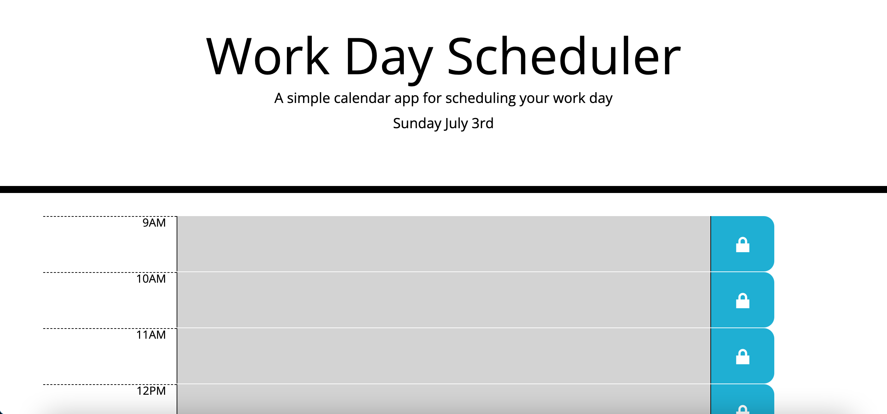

# Workday-Scheduler

This application is designed to be an interactive hour-by-hour day planner. It utilizes data persistence and active time monitoring to give the the user a fully-engaging experience.

INSTRUCTION

All that is required of the user for operation is input and saving. To input data, simply click on the text field of any time slot and enter your desired information. Then to save your new input, click on the save button (blue lock button) in your corresponding timeslot. Clicking the save button in each slot will only save information in that respective timeslot, *not* any of the others.

OPERATION

The essential parts of this application run through dynamically created javascript elements. Your input in each text field is saved in an array and stored within your local storage. On reload, this data is retrived from storage and set back into it's respective text areas. During this reload process, each time slot's time is checked against the current time to assign it it's proper color.

FINAL PRODUCT

LINK

https://tuckerjay.github.io/Workday-Scheduler/